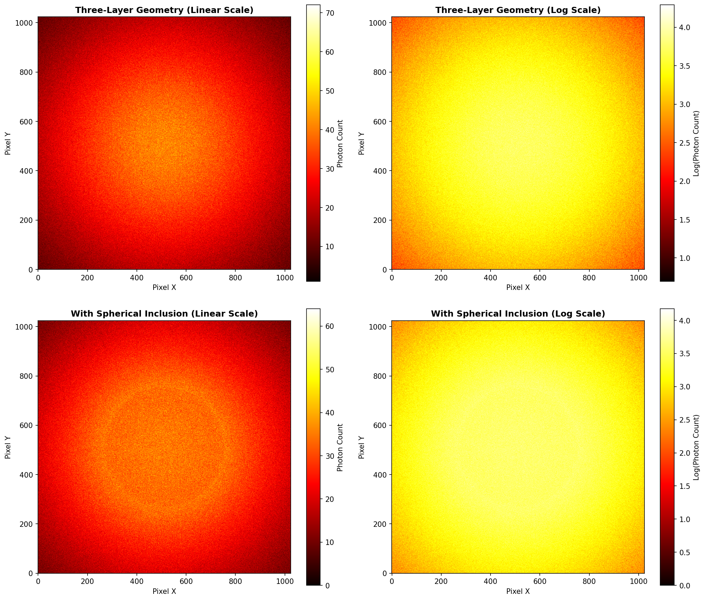
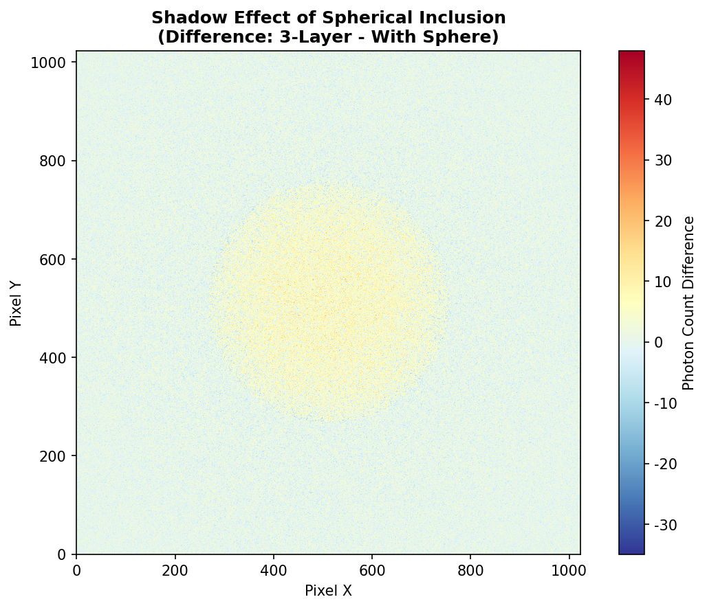
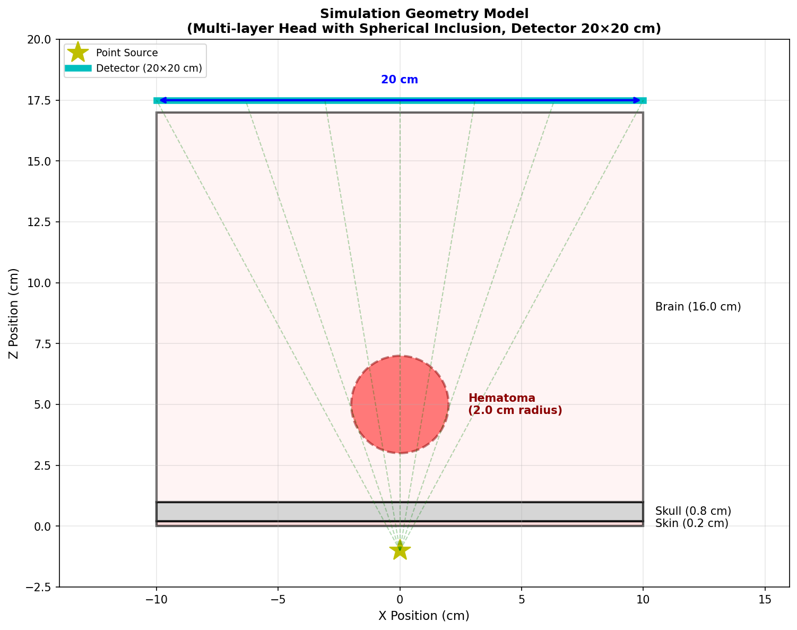
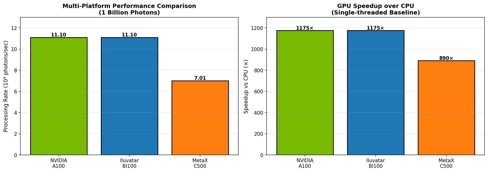

# 医学成像光子传输模拟

**选题**: 06 医学成像光子传输模拟（CUDA）  
**作者**: weiwei2027  
**训练营**: 2025冬季训练营 CUDA方向  

---

## 项目简介

本项目实现了一个 CUDA 加速的 X 射线光子传输模拟器，用于移动式头部 CT 成像系统。通过蒙特卡洛方法模拟光子穿过头部多层组织并处理球形异物（如血块），生成探测器投影图像。

### 核心特性

- ✅ 多层平板几何模型（皮肤、颅骨、脑组织）
- ✅ 球体异物支持（血块、肿瘤等病变模拟）
- ✅ 点源（锥形束）和平行束两种模式
- ✅ 多平台支持（NVIDIA、Iluvatar、MetaX、Moore）
- ✅ 处理速率：**1.11×10¹⁰ photons/sec**
- ✅ GPU vs CPU 加速：**~1000×+**（平台相关）

### 效果图展示

#### 探测器图像

*三层头部组织（上）与含血块阴影（下）的探测器图像对比*

#### 球体阴影效果

*球体异物产生的清晰阴影（差异图）*

#### 几何模型

*模拟几何模型：点源、多层头部组织、球体异物、探测器*

#### 多平台性能对比

*三大平台处理10亿光子的性能对比与加速比*

---

## 快速开始

### 编译

```bash
# NVIDIA 平台（默认）
make

# 其他平台
make PLATFORM=iluvatar   # 天數智芯
make PLATFORM=metax      # 沐曦
make PLATFORM=moore      # 摩尔线程
```

### 运行

```bash
# 基础测试（三层几何）
./photon_sim_nv \
    -g data/geometry_3layer.txt \
    -m data/materials.csv \
    -s data/source_point_10m.txt \
    -o output/

# 带球体异物
./photon_sim_nv \
    -g data/geometry_3layer_sphere.txt \
    -m data/materials.csv \
    -s data/source_point_10m.txt \
    -o output/
```

### 可视化结果

```bash
cd scripts
python3 visualize.py ../output/image.bin --info ../output/image_info.txt
```

---

## 目录结构

```
├── src/                    # 源代码
│   ├── photon_sim_nv.cu         # NVIDIA 版本
│   ├── photon_sim_iluvatar.cu   # Iluvatar 版本
│   ├── photon_sim_metax.maca    # MetaX 版本
│   ├── photon_sim_moore.mu      # Moore 版本
│   └── photon_sim_cpu.cpp       # CPU 基准
├── include/                # 头文件
│   ├── types.h
│   ├── utils.h
│   └── photon_sim.cuh      # 平台抽象层
├── data/                   # 测试数据
│   ├── geometry_*.txt      # 几何模型
│   ├── materials.csv       # 材料参数
│   └── source_*.txt        # 源配置
├── scripts/                # 可视化脚本
│   ├── visualize.py
│   └── generate_report_figures.py
├── report/                 # 技术报告
│   ├── REPORT.md           # 主报告
│   └── figures/            # 图表
├── Makefile                # 多平台构建
└── CMakeLists.txt
```

---

## 性能结果

| 平台 | GPU | 处理速率 (1B光子) |
|------|-----|------------------|
| RTX 4090 | RTX 4090 24GB | **4.88×10¹⁰ p/s** |
| NVIDIA A100 | A100 80GB | **1.11×10¹⁰ p/s** |
| Iluvatar BI100 | BI-100 | **1.11×10¹⁰ p/s** |
| MetaX C500 | C500 | **7.01×10⁹ p/s** |

> 测试配置：10亿光子，三层几何（皮肤0.2cm + 颅骨0.8cm + 脑组织16.0cm）

### RTX 4090 平台对比（同平台 CPU vs GPU）

| 实现 | 处理器 | 时间 (1B光子) | 处理速率 | 加速比 |
|------|--------|--------------|----------|--------|
| **GPU** | RTX 4090 24GB | 0.0205s | 4.88×10¹⁰ p/s | **基准** |
| **CPU** | Core i9-13900K (32核) | 61.4s | 1.63×10⁷ p/s | **~2,994×** |

> 注：加速比为同平台 GPU vs 单线程 CPU 的对比。不同平台使用不同 CPU，加速比不宜直接比较。详见 [report/REPORT.md](report/REPORT.md)

---

## 核心算法

### 蒙特卡洛光子传输
```
自由程采样: L = -ln(ξ) / μ
其中 ξ 为均匀分布随机数，μ 为线性衰减系数
```

### 光线-球体相交
```
判别式: Δ = b² - 4c
若 Δ ≥ 0 且 t_exit > 0，则光线与球体相交
```

### CUDA 优化策略
- **并行粒度**: 65,536 线程（256×256）
- **内存优化**: 常量内存缓存几何参数
- **原子操作**: `atomicAdd` 累加探测器像素
- **多平台抽象**: 统一接口支持4种GPU

---

## 输入文件格式

### 几何模型
```
layer skin 0.2 0.0 0.0 0.0 tissue_skin
layer skull 0.8 0.0 0.0 0.2 tissue_bone
layer brain 16.0 0.0 0.0 1.0 tissue_brain
sphere hematoma 2.0 0.0 0.0 5.0 tissue_blood
```

### 材料参数 (materials.csv)
```csv
material,energy_keV,mu
tissue_skin,50,0.2
tissue_bone,50,0.5
tissue_brain,50,0.18
```

### 源参数
```yaml
source_type = point
position = 0.0 0.0 -1.0
direction = 0.0 0.0 1.0
energy = 50.0
num_photons = 10000000
detector_position = 0.0 0.0 17.5
detector_size = 20.0 20.0
detector_pixels = 1024 1024
```

---

## 详细文档

- [DESIGN.md](DESIGN.md) - 物理模型与算法设计
- [PROJECT_REQUIREMENTS.md](PROJECT_REQUIREMENTS.md) - 赛题要求对照
- [report/REPORT.md](report/REPORT.md) - 完整技术报告（含NCU分析）

---

**项目时间**: 2025.2.10 - 2026.3.16  
**状态**: ✅ 已完成并验证
