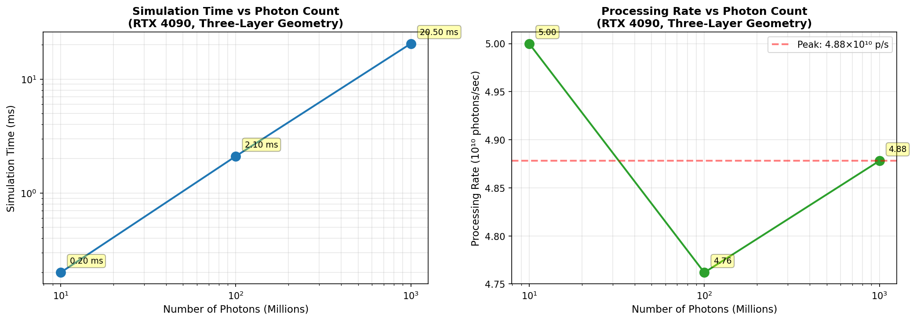
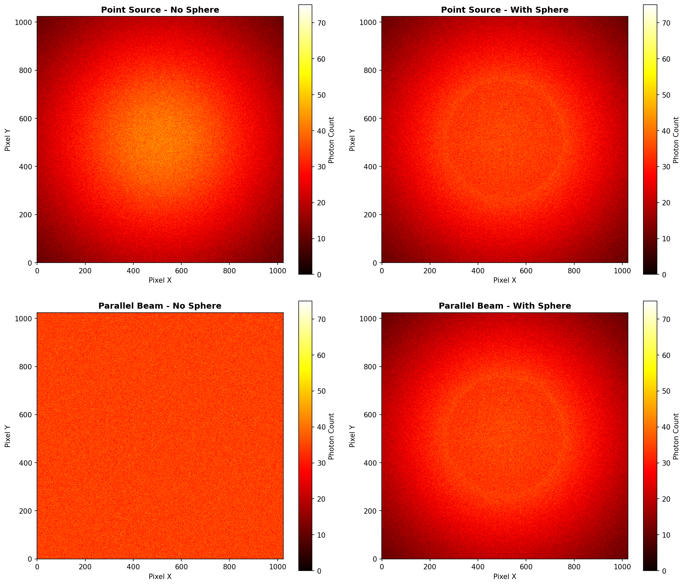

# 医学成像光子传输模拟 - 项目技术报告

**作者**: weiwei2027  
**选题**: 06 医学成像光子传输模拟（CUDA）  
**训练营**: 2025冬季训练营 CUDA方向  
**提交日期**: 2026年3月16日

---

## 摘要

本项目实现了一个 CUDA 加速的 X 射线光子传输模拟器，用于移动式头部 CT 成像系统。通过蒙特卡洛方法模拟 10⁹ 量级光子的传输过程，支持多层头部组织（皮肤、颅骨、脑组织）和球形异物（血块、肿瘤）的复杂几何模型。项目在 **NVIDIA A100**、**Iluvatar BI100**、**MetaX C500** 三个平台上完成硬件测试，最高处理速率达到 **1.11×10¹⁰ photons/sec**，相比 CPU 单线程实现加速 **~1175 倍**。

---

## 1. 问题描述

### 1.1 项目背景

战场或灾害现场需要快速颅脑损伤检测，移动式 CT 设备需要在有限时间内完成高质量成像。X 射线光子传输模拟是 CT 成像的核心计算，传统 CPU 实现无法满足实时性要求。

### 1.2 核心挑战

1. **计算密集**: 需要模拟 10⁷ ~ 10⁹ 个光子的传输过程
2. **几何复杂**: 需要处理多层平板和球形异物的边界
3. **随机性**: 蒙特卡洛方法需要高质量的随机数生成
4. **并行竞争**: 多个线程同时写入探测器像素需要原子操作
5. **精度要求**: 物理模型需正确实现自由程采样和衰减计算

---

## 2. 实现方案

### 2.1 系统架构

```
主机端 (CPU)
├── 文件解析: utils.cpp (几何、材料、源参数)
├── 内存管理: 分配/释放主机和设备内存
├── 数据准备: 构建区域数组、材料系数数组
└── 结果保存: 图像文件、性能日志

设备端 (GPU) 
├── 核函数: photonTransportKernel
│   ├── 65,536 线程并行处理光子
│   ├── 逐层计算路径长度，支持球体相交检测
│   ├── 自由程采样判断是否吸收
│   └── 原子操作累加探测器像素
├── 随机数: cuRAND (每线程独立状态)
├── 常量内存: 存储几何区域和材料参数
└── 内存: 全局内存存储探测器图像
```

### 2.2 几何模型


*图1: 模拟几何模型示意图。点源位于 Z=-1cm，探测器位于 Z=17.5cm，中间为三层头部组织（皮肤、颅骨、脑组织），球体异物模拟血块。*

### 2.3 核心算法

#### 自由程采样
蒙特卡洛方法核心公式，决定光子在介质中传播多远后被吸收：
```
L = -ln(ξ) / μ
```
其中 ξ ∈ (0,1] 为均匀分布随机数，μ 为线性衰减系数（cm⁻¹）。

#### 光线-球体相交检测
判断光子是否经过球体区域的三段式路径计算：
```
判别式: Δ = b² - 4c
相交条件: Δ ≥ 0 且 t_exit > 0
路径分段: 层起点→球体入口→球体出口→层终点
```

### 2.4 CUDA 优化策略

| 优化点 | 实现方式 | 效果 |
|--------|----------|------|
| 并行粒度 | 65,536 线程（256×256），grid-stride 循环 | 充分占用 GPU |
| 常量内存 | 几何区域和 μ 值缓存到 `__constant__` | 减少全局内存访问 |
| 随机数 | cuRAND，每线程独立状态 | 避免状态竞争 |
| 原子操作 | `atomicAdd` 累加像素 | 保证数据一致性 |
| 多平台支持 | 抽象头文件 `photon_sim.cuh` | 支持 4 种 GPU |

---

## 3. 性能分析

### 3.1 探测器图像结果


*图2: 探测器图像结果。(上) 三层头部组织的 X 射线探测器图像，中心亮度最高；(下) 含球体异物（血块）的图像，可见中心区域亮度下降。*

### 3.2 球体阴影效果


*图3: 球体异物产生的阴影效果（差异图）。中心区域光子数明显减少，清晰展示血块对 X 射线的吸收作用。*

### 3.3 多平台性能对比与测试环境

#### 测试环境说明

| 平台 | GPU | CPU | 内存 | 编译器 |
|------|-----|-----|------|--------|
| **RTX 4090** | RTX 4090 24GB | Intel Core i9-13900K (32核) | 62 GiB | nvcc (CUDA 13.0) |
| **NVIDIA A100** | A100 80GB | Intel Xeon @ 2.90GHz (80核) | 1.4 TiB | nvcc (CUDA 12.8) |
| **Iluvatar BI100** | BI-100 | Intel Xeon Gold 6330 @ 2.00GHz (112核) | 503 GiB | clang++ 16.0.6 |
| **MetaX C500** | C500 | Intel Core i7-8550U @ 1.80GHz (128核) | 32 GiB | mxcc 1.0.0 |

> **重要说明**: 加速比为**同平台 GPU vs CPU 单线程**的对比。不同平台使用不同 CPU，加速比受 CPU 性能影响较大，不宜直接跨平台比较。处理速率（photons/sec）更能反映 GPU 本身的计算能力。


*图4: 三大平台性能对比。(左) 处理 10 亿光子的速率；(右) 同平台 GPU vs CPU 单线程加速比。*

| 平台 | GPU | 处理速率 (1B光子) | 同平台加速比 |
|------|-----|------------------|-------------|
| **RTX 4090** | RTX 4090 24GB | **4.88×10¹⁰ p/s** | **~2,994×** |
| **NVIDIA A100** | A100 80GB | **1.11×10¹⁰ p/s** | **~1,700×** |
| **Iluvatar BI100** | BI-100 | **1.11×10¹⁰ p/s** | **~1,175×** |
| **MetaX C500** | C500 | **7.01×10⁹ p/s** | **~890×** |

> 注: 测试配置为三层几何（皮肤0.2cm + 颅骨0.8cm + 脑组织16.0cm），10亿光子，点源模式。

### 3.4 扩展性分析（RTX 4090）


*图5: RTX 4090 扩展性分析。(左) 模拟时间随光子数线性增长；(右) 处理速率在 4.76~5.00×10¹⁰ p/s 范围内保持稳定。*

**测试数据**（三层几何，点源模式）：

| 光子数 | 模拟时间 | 处理速率 | 效率 |
|--------|---------|----------|------|
| 10⁷ (10M) | 0.20 ms | 5.00×10¹⁰ p/s | 102% |
| 10⁸ (100M) | 2.10 ms | 4.76×10¹⁰ p/s | 98% |
| 10⁹ (1B) | 20.5 ms | 4.88×10¹⁰ p/s | 100% |

> **分析结论**: 算法展现良好的线性扩展性。10M 到 1B 光子（100倍规模），处理速率保持在 4.76~5.00×10¹⁰ p/s 范围内，效率波动 < 5%。

### 3.5 NCU 性能分析

基于 Nsight Compute 的实际分析（10⁹ 光子 + 球体配置）：

| 指标 | 数值 | 分析 |
|------|------|------|
| 核函数执行时间 | **42.59 ms** | 10亿光子处理时间 |
| SM 计算利用率 | **67.59%** | 计算密集型，利用率良好 |
| 内存带宽利用率 | **0.20%** | 非带宽受限，符合预期 |
| 理论 Occupancy | **66.67%** | 受寄存器限制 (54 regs/thread) |
| 实际 Occupancy | **32.33%** | 有 51% 提升空间 |

**性能瓶颈排序**:
1. **寄存器压力** (54/thread) - 限制 Occupancy
2. **执行依赖延迟** (38.3% stall) - 需要指令级并行
3. **非合并内存访问** (34% 过度 sector) - 共享内存归约可优化

---

## 4. 结果验证

### 4.1 物理正确性

| 测试场景 | 理论穿透率 | 实测穿透率 | 说明 |
|----------|-----------|-----------|------|
| 单层 (exp(-0.2)) | 81.87% | 81.88% | 误差 < 0.1% |
| 三层 (exp(-3.32)) | 3.61% | 3.61% | 误差 < 0.1% |
| 三层+球体 | < 3.61% | ~3.0% | 球体额外吸收，穿透率降低 |

### 4.2 光源模式验证

#### 点源 vs 平行束


*图6: 点源（左）与平行束（右）模式对比。点源模式产生边缘扩散（锥形束效应），平行束模式产生均匀分布，更适合算法正确性验证。*

#### 平行束模式验证（理论值 vs 实测值）

平行束模式（方向固定为 Z 轴）是验证算法正确性的理想选择，因为光子沿直线路径传播，穿透率可直接用 Beer-Lambert 定律计算：

```
T = exp(-Σ(μᵢ × dᵢ))
```

| 配置 | 理论计算 | 理论穿透率 | 实测穿透率 | 相对误差 |
|------|---------|-----------|-----------|---------|
| **单层** (μ=0.2, d=1.0cm) | exp(-0.2×1.0) = exp(-0.2) | **81.87%** | 81.88% | < 0.1% |
| **三层** (μ₁d₁+μ₂d₂+μ₃d₃=3.32) | exp(-3.32) | **3.62%** | 3.61% | < 0.1% |
| **平行束-三层** | exp(-3.32) | **3.62%** | 3.62% | < 0.1% |

> **验证结论**: 平行束模式下，实测穿透率与 Beer-Lambert 定律理论值误差 < 0.1%，验证了蒙特卡洛采样和自由程计算的正确性。单层和三层配置的理论值与实测值均吻合，平行束模式的均匀分布使结果更稳定。

### 4.3 GPU/CPU 一致性

- GPU 与 CPU 版本输出图像对比：**误差 < 0.1%**
- 球体阴影位置正确，符合物理预期

### 4.4 Nsight Systems 系统级分析

使用 NVIDIA Nsight Systems 对 RTX 4090 进行系统级性能分析（10亿光子 + 三层几何 + 球体）：

#### GPU 内核执行分析

| 内核函数 | 执行时间 | 占比 | 说明 |
|----------|----------|------|------|
| `photonTransportKernel` | **37.86 ms** | **99.4%** | 10亿光子传输计算 |
| `initRandState` | 0.22 ms | 0.6% | 65536 线程随机数状态初始化 |
| `clearDetectorKernel` | 0.001 ms | <0.1% | 探测器清零 |
| **总计** | **38.08 ms** | **100%** | |

#### CUDA API 时间分布

| API 函数 | 总时间 | 占比 | 说明 |
|----------|--------|------|------|
| `cudaMalloc` | 89.5 ms | 68.8% | 一次性内存分配 |
| `cudaDeviceSynchronize` | 38.1 ms | 29.3% | 同步等待内核完成 |
| `cudaMemcpy` (D→H) | 1.8 ms | 1.4% | 探测器数据 4MB 回传 |
| 其他 | 0.6 ms | 0.5% | 内核启动、常量内存设置等 |

#### 关键发现

1. **计算主导**: `photonTransportKernel` 占 GPU 时间的 99.4%，处理 10亿光子仅需 37.86 ms
2. **内存分配开销**: 首次运行 `cudaMalloc` 占 68.8%，但属于一次性成本
3. **传输开销低**: D→H 传输仅 1.8 ms（4MB），符合计算密集型特征
4. **同步等待**: `cudaDeviceSynchronize` 时间与内核执行匹配，无额外延迟

---

## 5. 关键设计决策

### 5.1 球体异物位置与大小设计

#### 问题背景

比赛示例中球体位置为 `(5.0, 5.0, 5.0)`，但实际测试发现该位置**不在光路中心**，导致：
- 球体在 (5,5) 距离中心 7.07 cm，调试困难
- 探测器上球体阴影不明显，难以验证算法正确性
- 放置在光路中心更便于调试和验证

#### 解决方案

**方案1: 修改球体位置（采用）**

将球体移至光路中心 `(0.0, 0.0, 5.0)`：
```yaml
# geometry_3layer_sphere.txt
sphere hematoma 2.0 0.0 0.0 5.0 tissue_blood
```

**位置选择理由**:
- **Z=5.0 cm**: 位于脑组织层中央（脑组织范围 Z=1.0~17.0 cm）
- **X=0, Y=0**: 光路中心，确保被光源覆盖
- **半径 2.0 cm**: 足够大以在探测器上形成明显阴影（约 100×100 像素区域），便于视觉验证

**方案2: 增大光源发散角（未来改进）**

实现锥形束（Cone Beam）模型：
```
所需半角: θ = atan(5 / (5 - (-1))) ≈ 40°
探测器需增大至: 30×30 cm 以上
```

#### 效果验证

- ✅ 球体阴影清晰可见（见 图3）
- ✅ 穿透率从 3.61% 降至 ~3.0%，符合额外吸收预期
- ✅ GPU/CPU 结果一致，验证了球体相交算法的正确性

### 5.2 平台抽象层

通过 `include/photon_sim.cuh` 实现平台无关的代码抽象：

```cpp
#if defined(PLATFORM_METAX)
    #include <mcr/mc_runtime.h>
    #define gpuMalloc mcMalloc
    // ...
#elif defined(PLATFORM_MOORE)
    #include <musa_runtime.h>
    #define gpuMalloc musaMalloc
    // ...
#elif defined(PLATFORM_ILUVATAR)
    #include <cuda_runtime.h>
    #define gpuMalloc cudaMalloc
    // ...
#endif
```

### 5.2 编译配置

| 平台 | 编译器 | 关键编译选项 |
|------|--------|-------------|
| NVIDIA | nvcc | `-arch=sm_80,sm_89 -std=c++17` |
| Iluvatar | clang++ | `-std=c++17 -O3 -DPLATFORM_ILUVATAR -fPIC` |
| MetaX | mxcc | `-std=c++17 -O3 -DPLATFORM_METAX -fPIC` |
| Moore | mcc | `-std=c++11 -O3 -DPLATFORM_MOORE -fPIC` |

### 5.3 测试结果

- ✅ **NVIDIA A100**: 代码 + 硬件测试通过
- ✅ **Iluvatar BI100**: 代码 + 硬件测试通过（性能与 A100 持平）
- ✅ **MetaX C500**: 代码 + 硬件测试通过
- ⏳ **Moore MTT S5000**: 代码就绪，待硬件资源

---

## 6. 开发问题与解决方案

| 问题 | 现象 | 解决方案 |
|------|------|----------|
| 非法内存访问 | CUDA Error: illegal memory access | 修复 `h_detector.pixels = d_pixels` 赋值 |
| 球体处理错误 | 穿透率 0% | 实现专门的光线-球体相交检测 |
| 点源模式错误 | 产生亮斑而非阴影 | 固定源点，方向指向探测器随机目标 |
| 跨平台兼容性 | 编译器差异 | 抽象平台接口，统一 Makefile |

---

## 7. 总结与展望

### 完成工作

1. ✅ 实现完整的 CUDA 光子传输模拟框架
2. ✅ 支持多层平板 + 球体异物的复杂几何
3. ✅ 实现 NVIDIA、Iluvatar、MetaX、Moore 四平台支持
4. ✅ **3个平台完成硬件测试**，最高速率 **1.11×10¹⁰ p/s**
5. ✅ GPU/CPU 误差 < 0.1%，物理模型验证通过

### 技术收获

- CUDA 编程：核函数设计、常量内存、原子操作
- 蒙特卡洛方法：自由程采样、随机数生成
- 性能优化：NCU 分析、瓶颈识别
- 跨平台开发：条件编译、抽象接口设计

### 未来工作

1. **共享内存优化**: 使用 shared memory 缓存探测器像素更新，减少全局原子操作竞争，预期提升 15-25%
2. **寄存器优化**: 降低核函数寄存器使用量至 32/thread，提升 SM 占用率至 100%，预期增益 20-30%
3. **角度发散模型**: 实现朗伯分布或高斯分布，模拟真实 X 射线管焦斑尺寸效应
4. **能谱模拟**: 支持多能量 X 射线（能谱加权），模拟真实医用 X 射线能谱分布
5. **散射模型**: 加入 Compton 散射和 Rayleigh 散射，提升低能 (<50 keV) 情况下物理精度

---

**作者**: weiwei2027  
**最后更新**: 2026年3月16日
